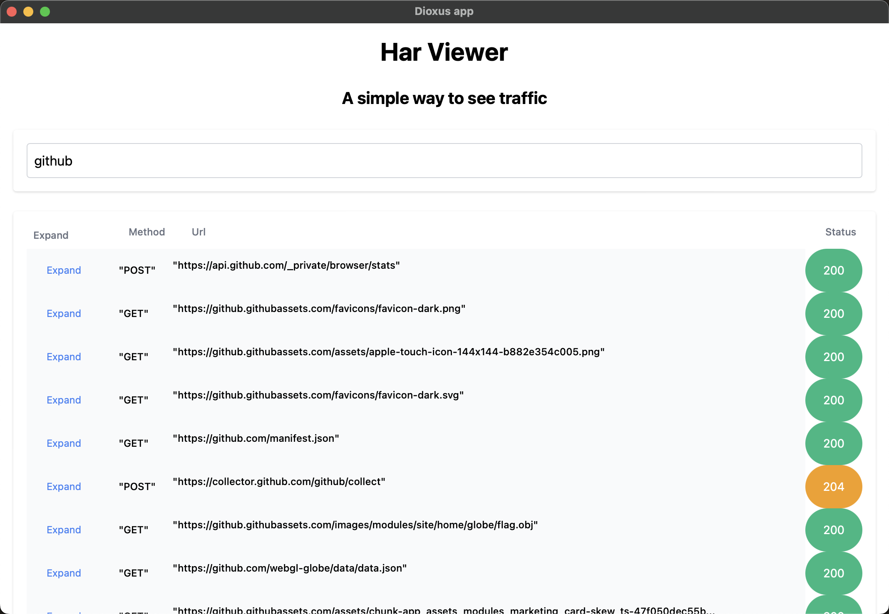

# har-viewer

The har-viewer is a simple application written in Rust that allows you to view and analyze HTTP Archive (HAR) files.

## Features
- Load and parse HAR files
- Display detailed information about each request and response
- Filter and search requests
- Visualize request/response data in (quite) a user-friendly format

## Installation
To install and run the har-viewer, follow these steps:

1. Install dioxus pre-requirements on [Platform-specific dependencies](https://dioxuslabs.com/learn/0.4/getting_started/desktop#platform-specific-dependencies)
2. Build the application: `cargo build --release`
3. Run the application: `cd target/release && ./har-viewer --file <FILE>`

## Contributing
Contributions are welcome! If you have any ideas, suggestions, or bug reports, please open an issue or submit a pull request on the [GitHub repository](https://github.com/your-username/har-viewer).

## License
This project is licensed under the [MIT License](LICENSE).